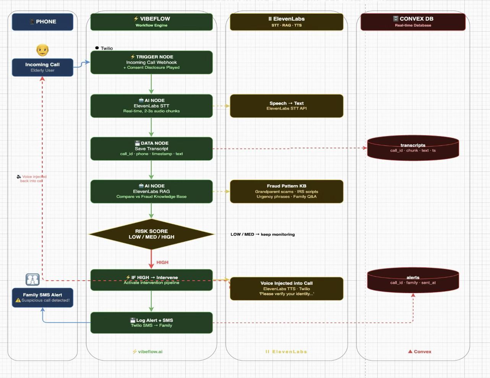
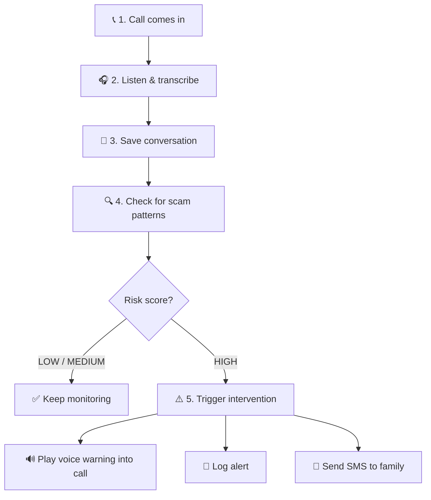
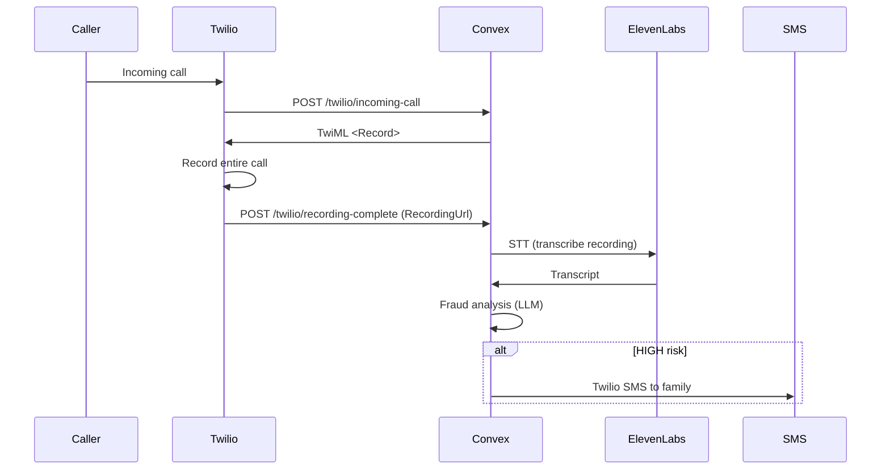
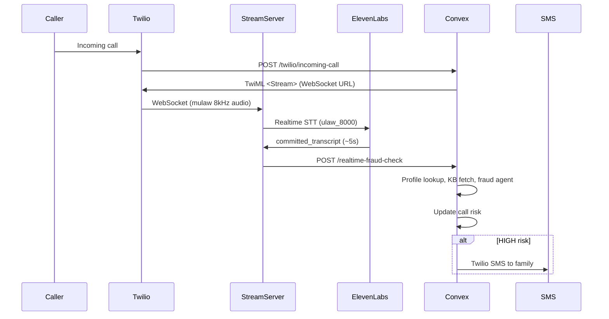
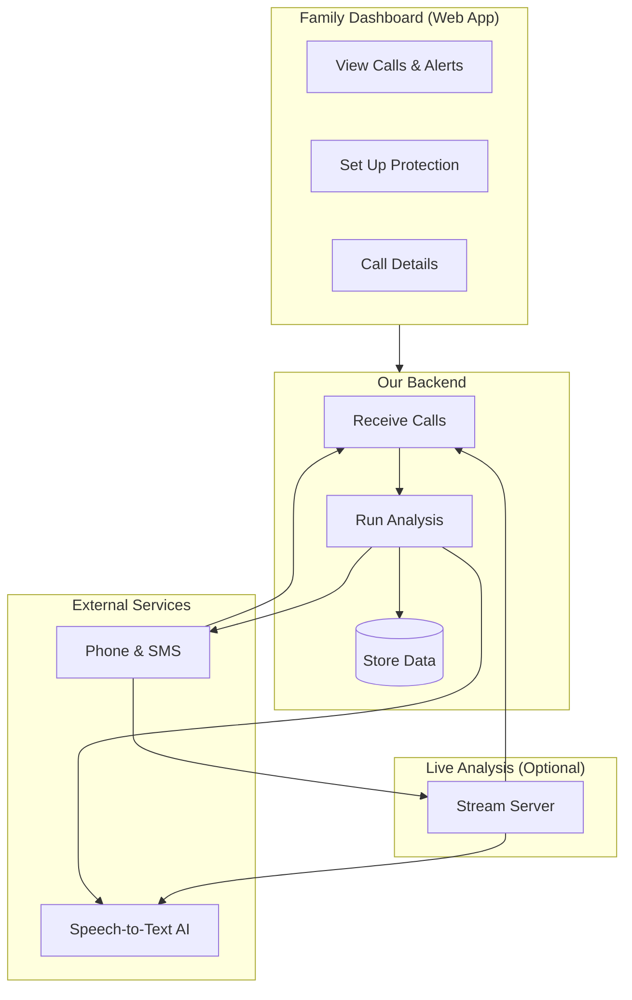
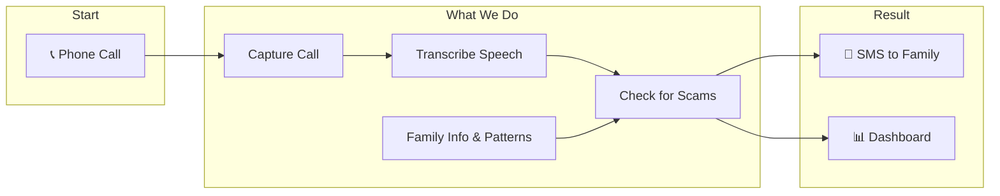

# EchoGuard

**AI-Powered Real-Time Scam Call Detection** — Protect your loved ones from phone fraud with intelligent call monitoring and instant alerts.

[](https://docs.google.com/presentation/d/1oTSyVEqXxRP46TQPBj9jivdWh_Y5iZrBk3NAQw1EadM/edit?usp=sharing)
[](https://youtube.com/shorts/5_yP_Th5EiA)
[](https://app.vibeflow.ai/shared/uFB75kWePHC38Zgu)

---

## Overview

EchoGuard monitors incoming phone calls in real time, transcribes conversations using AI speech-to-text, and analyzes them for fraud indicators. When a high-risk scam is detected, family members receive instant SMS alerts so they can intervene before it's too late.

### Key Features

- **Real-time & post-call analysis** — Works with Twilio Media Streams (real-time) or recording webhooks (post-call fallback)
- **AI fraud detection** — LLM-powered analysis of call transcripts against scam patterns
- **Instant SMS alerts** — Family members notified immediately on high-risk calls
- **Knowledge base** — Custom context (e.g., elderly's financial info) for smarter risk assessment
- **Dashboard** — View call history, risk scores, and active alerts

---

## Architecture

*How EchoGuard protects your loved ones — explained in simple terms.*

### EchoGuard Architecture (Visual)

*High-level view: Call comes in → We transcribe it → AI checks for scam patterns → If high risk, we alert the family and can play a warning into the live call.*



### System Overview — How It Works



Call comes in → AI transcribes it → We save and check for scam patterns (grandparent scams, IRS impersonation, urgent language, family Q&A) → Risk score: LOW / MEDIUM / HIGH → If HIGH: play voice warning, log alert, send SMS to family.

*Details:* Scam patterns include grandparent scripts, IRS/Medicare impersonation, high-pressure language, and family verification Q&A. On HIGH risk we play: *"We've detected unusual patterns. Please answer this question to verify your identity."*

**Step 2 — Listen & transcribe**  
AI converts the spoken conversation into text in real time, so we can analyze what’s being said.

**Step 3 — Save the conversation**  
The transcript is stored with the call details (time, caller ID, etc.) for records and analysis.

**Step 4 — Check for scam patterns**  
AI compares the conversation against known scam patterns, including:
- Grandparent scam scripts (“Grandma, I’m in trouble, send money”)
- IRS / Medicare impersonation
- Urgent, high-pressure language
- Family verification questions (set up by the family in advance)

**Step 5 — Risk score**  
Each call gets a risk level: **LOW**, **MEDIUM**, or **HIGH**.

**Step 6 — If HIGH risk**  
When a scam is likely, the system:
- **Plays a voice message** into the call: *“We’ve detected unusual patterns. Please answer this question to verify your identity.”*
- **Logs the alert** in our database
- **Sends an SMS** to the family member so they can call and check on their loved one

---

### Post-Call Flow — Analyze After the Call Ends

*Use this when real-time analysis isn’t set up. The call is recorded, then analyzed once it’s over.*

Call → Record full call → Transcribe recording → Analyze for fraud → If high risk, send SMS to family.



---

### Real-Time Flow — Analyze During the Call (Recommended)

*Use this when the stream server is deployed. The call is analyzed live while it’s happening.*

 Call → Stream audio live → Transcribe in real time → Analyze every few seconds → If high risk, send SMS to family immediately.



---

### What’s in the System? — Component Overview

- **Family dashboard** — Web app where family members set up protection and view call history  
- **Phone & AI services** — Twilio handles calls; ElevenLabs transcribes speech  
- **Backend** — Stores data, runs fraud analysis, sends alerts  
- **Real-time server** *(optional)* — Enables live analysis during the call



---

### End-to-End: From Call to Alert

A call comes in → We capture it → AI transcribes and analyzes it → If it looks like a scam, we alert the family and can play a warning into the call.



---

## Tech Stack

| Layer | Technology |
|-------|------------|
| Frontend | React, Vite, Tailwind CSS, Radix UI |
| Backend | Convex (serverless functions, real-time DB) |
| Auth | Convex Auth |
| Voice | Twilio (Media Streams, Recordings, SMS) |
| STT | ElevenLabs (realtime + batch) |
| AI | OpenAI GPT-4o-mini (fraud analysis agent) |

### Where OpenAI Is Used

**OpenAI (GPT-4o-mini)** powers the fraud analysis step. The agent lives in `convex/agents/fraudAnalysisAgent.ts` and analyzes call transcripts against known scam patterns (grandparent scam, IRS impersonation, gift card requests, etc.) to output a risk score (LOW / MEDIUM / HIGH).

**Flow:** Transcript → `fraudAnalysisAgent` (OpenAI) → Risk score → SMS alert if HIGH.

ElevenLabs handles **speech-to-text** (STT) and **text-to-speech** (TTS); OpenAI handles the **fraud analysis** logic.

---

## Quick Start

### Prerequisites

- Node.js 18+
- [Convex](https://convex.dev) account
- [Twilio](https://twilio.com) account
- [ElevenLabs](https://elevenlabs.io) API key

### 1. Clone & Install

```bash
git clone <repo-url>
cd EchoGuard
pnpm install
```

### 2. Convex Setup

```bash
npx convex dev
```

Set environment variables in Convex Dashboard:

| Variable | Description |
|----------|-------------|
| `API_ELEVENLABS_KEY` | ElevenLabs API key |
| `API_TWILIO_KEY` | Twilio auth token |
| `TWILIO_PHONE_NUMBER` or `API_TWILIO_FROM` | Twilio phone number for SMS |
| `CONVEX_SITE_URL` | Your Convex site URL |
| `STREAM_SERVER_URL` | (Optional) `wss://your-stream-server` for real-time |

### 3. Twilio Configuration

- **Voice webhook**: `https://YOUR_CONVEX_SITE/twilio/incoming-call`
- Recording callback is set automatically in TwiML

### 4. Run the App

```bash
pnpm dev
```

Visit `http://localhost:5173` and complete onboarding with your monitored phone number (Twilio number).

---

## Real-Time Stream Server (Optional)

For real-time analysis during calls, the stream server (`realtime-stream/`) receives Twilio Media Streams and forwards audio to ElevenLabs STT. **Deploy via VibeFlow** — the platform handles hosting and deployment.

If deploying manually, set `STREAM_SERVER_URL` in Convex to your stream server’s `wss://` URL. See [realtime-stream/README.md](realtime-stream/README.md) for local setup.

---

## Project Structure

```
EchoGuard/
├── src/                 # React frontend
│   ├── pages/           # Home, Onboarding, Call Detail
│   ├── components/      # UI components
│   └── App.tsx
├── convex/              # Backend (Convex)
│   ├── http.ts          # Twilio webhooks, realtime-fraud-check
│   ├── actions.ts       # Flow actions
│   ├── agents/          # Fraud analysis agent
│   └── schema.ts        # Database schema
├── realtime-stream/     # WebSocket server (Twilio → ElevenLabs → Convex)
└── docs/                # Architecture docs
```

---

## Links

| Resource | Link |
|----------|------|
| **Pitch Deck** | [Google Slides](https://docs.google.com/presentation/d/1oTSyVEqXxRP46TQPBj9jivdWh_Y5iZrBk3NAQw1EadM/edit?usp=sharing) |
| **YouTube Demo** | [Watch Short](https://youtube.com/shorts/5_yP_Th5EiA) |
| **VibeFlow** | [Live Demo](https://app.vibeflow.ai/shared/uFB75kWePHC38Zgu) |

---

## License

Private — All rights reserved.
